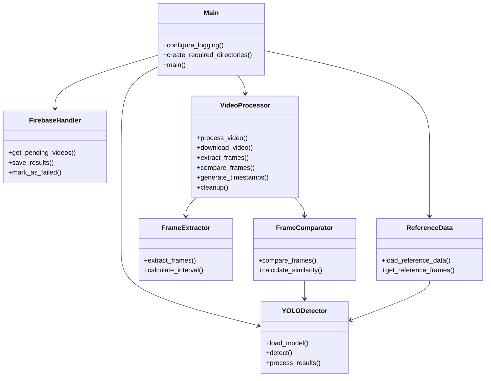
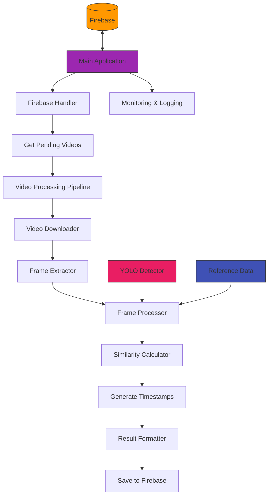
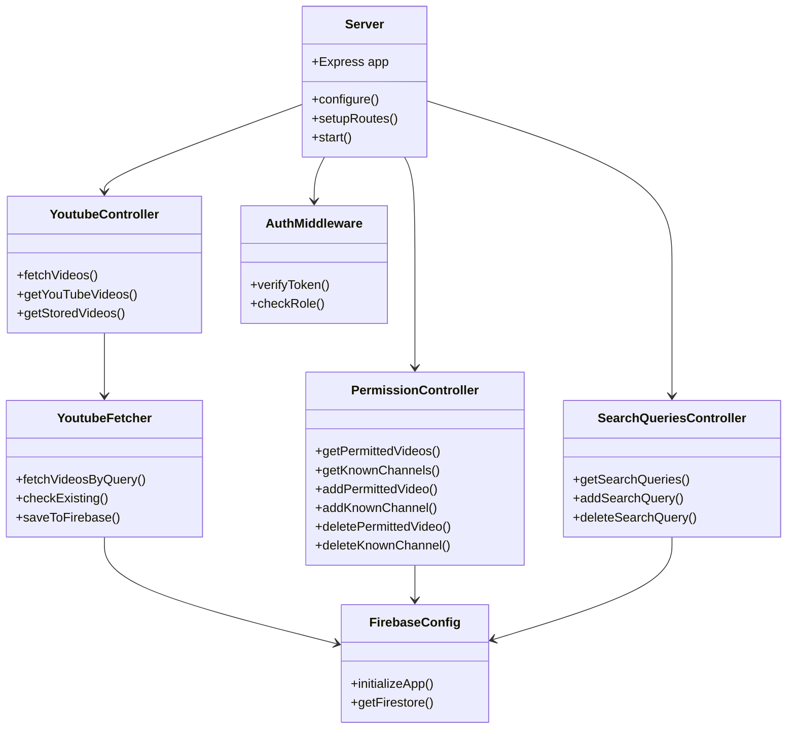
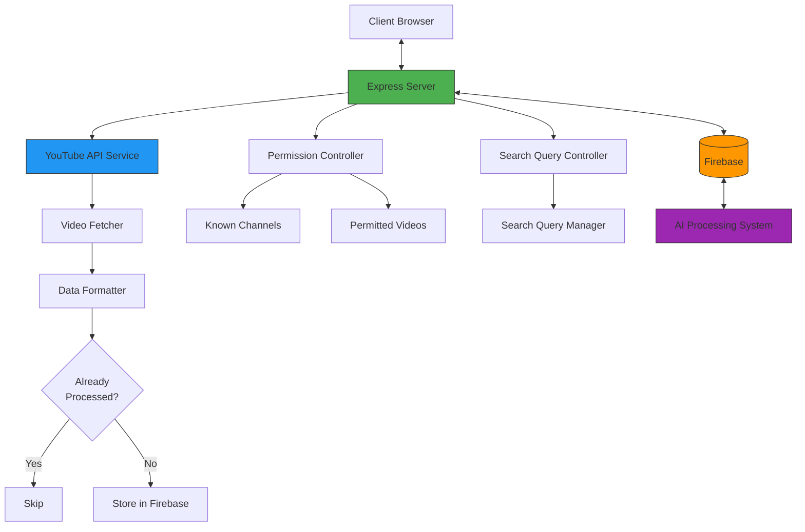
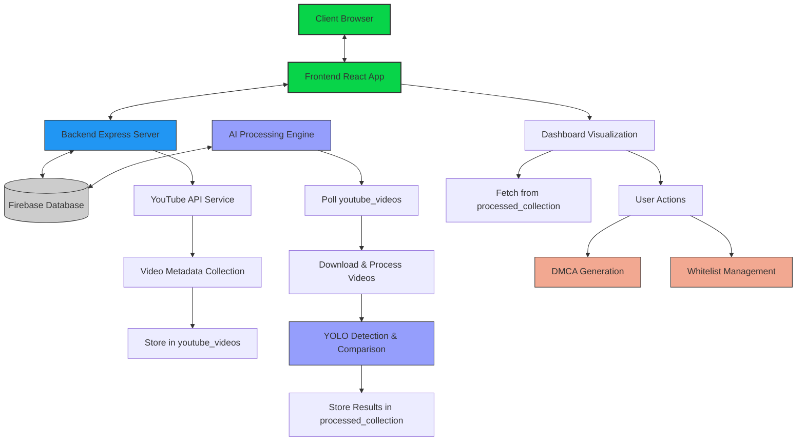
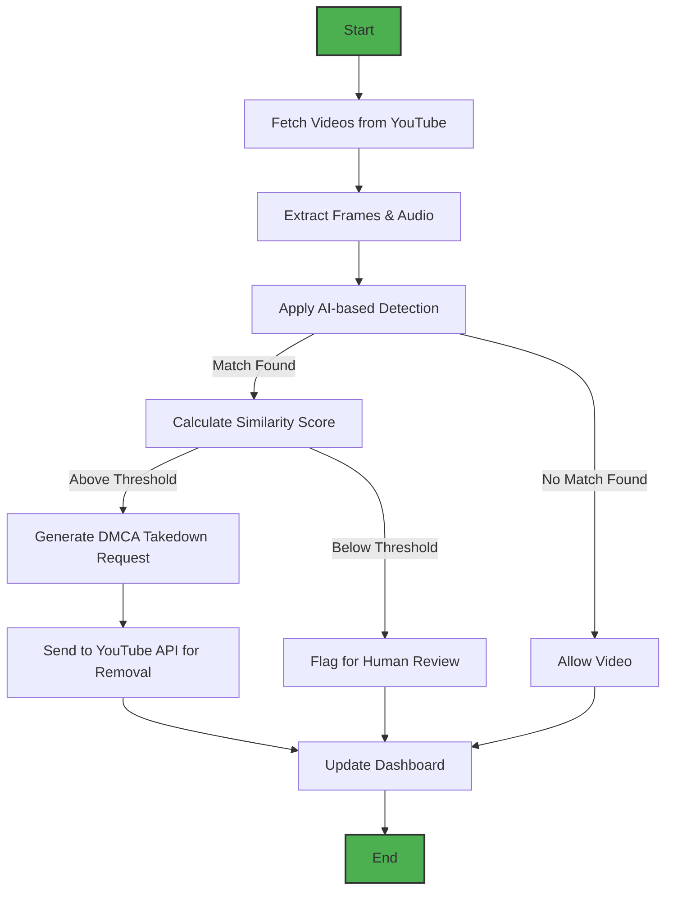
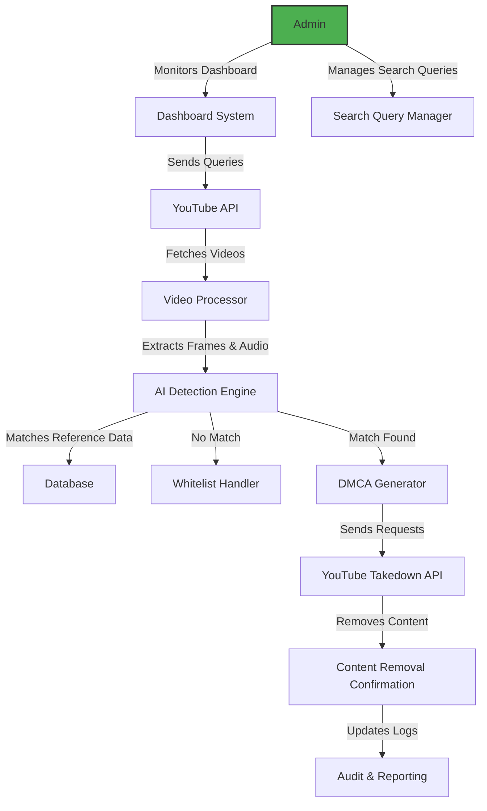

# 🛡️ Safeguarding Stories: AI for Intellectual Property Protection


## 🌟 Overview

Safeguarding Stories is an advanced AI-driven system designed to protect Disney's vast intellectual property from cyber threats and unauthorized distribution. By leveraging deep learning, computer vision, and natural language processing, our solution provides real-time monitoring, automated DMCA takedown capabilities, and predictive analytics to identify emerging piracy trends.

## ✨ Key Features

- **Real-time Content Monitoring** across YouTube and other platforms
- **AI-powered Detection** of visual, audio, and scene-based IP infringement
- **Automated DMCA Generation** for swift takedown of infringing content
- **Predictive Analytics** to identify piracy hotspots and trends
- **Whitelist Management** for authorized content partners
- **User-friendly Dashboard** with comprehensive reporting capabilities

## 🧩 System Architecture

Our system consists of three major components that work together seamlessly:

### 1. Backend Service

The backend handles YouTube data collection, search query management, and provides API endpoints for the frontend dashboard.

```
📦 Backend  
 ┣ 📂 controllers/  
 ┃ ┣ 📜 permissionController.js
 ┃ ┣ 📜 searchQueriesController.js
 ┃ ┗ 📜 youtubeController.js
 ┣ 📂 routes/  
 ┃ ┣ 📜 permissionRoutes.js
 ┃ ┣ 📜 searchQueries.js
 ┃ ┗ 📜 youtubeRoutes.js
 ┣ 📂 middleware/  
 ┃ ┣ 📜 authMiddleware.js
 ┃ ┗ 📜 errorHandler.js
 ┣ 📂 config/  
 ┃ ┗ 📜 firebase.js
 ┣ 📂 firebase/  
 ┃ ┗ 📜 serviceAccountKey.json
 ┣ 📂 script/  
 ┃ ┗ 📜 youtubeFetcher.js
 ┣ 📜 server.js
 ┗ 📜 .env
```

### 2. AI Processing Engine

The AI component handles the core detection functionality, comparing videos against reference content to identify IP violations.

```
📦 AI
 ┣ 📂 .venv
 ┃ ┗ --
 ┣ 📂 assets
 ┃ ┣ 📂 frames
 ┃ ┗ 📂 videos //refrence video for matching the frames
 ┣ 📂 dmca
 ┃ ┗ --
 ┣ 📂 logs
 ┃ ┗ 📜processing.log
 ┣ 📂 processing
 ┃ ┣ 📂processed_videos
 ┃ ┗ 📂queue
 ┣ 📂 src
 ┃ ┣ 📂 firebase
 ┃ ┃ ┣ firebase_handler.py
 serviceAccountKey.json
 ┃ ┣ 📂 models
 ┃ ┣ 📂pretrained
 ┃ ┃ ┣ 📜coco.names
 ┃ ┃ ┣ 📜yolov4.cfg
 ┃ ┃ ┗ 📜yolov4.weights
 ┃ ┗ yolo_detector.py
 ┃ ┣ 📂 processing
 ┃ ┗ 📂 utils
 ┣ 📜 main.py
 ┗ 📜 requirements.txt  # Python dependencies
```

### 3. Frontend Dashboard

The frontend provides an intuitive interface for monitoring IP protection efforts and managing the system.
```
📦 Client
 ┣ 📂 public/  # Static assets
 ┣ 📂 src/
 ┃ ┣ 📂 components/  # UI components
 ┃ ┣ 📂 pages/  # Application pages
 ┃ ┣ 📂 services/  # API services
 ┃ ┣ 📂 store/  # State management
 ┃ ┣ 📂 styles/  # Component styling
 ┃ ┗ 📂 utils/  # Utility functions
 ┣ 📜 package.json  # Dependencies
 ┗ 📜 .env  # Environment variables
```

## 🛠️ Technology Stack

### AI & Machine Learning
- TensorFlow/PyTorch for deep learning models
- OpenCV for video processing and frame extraction
- YOLO object detection for identifying Disney IP elements
- NumPy and Pandas for data manipulation
- Google API Client for YouTube integration

**Detailed AI Component Architecture**


**AI System Architecture and Data Flow**


### Backend
- Node.js and Express for the web server
- Firebase Admin SDK for database and authentication
- Axios for HTTP requests
- JWT for secure authentication
- CORS for cross-origin resource sharing

**Detailed Backend Component Architecture**


**System Architecture**


### Frontend
- React for user interface components
- Redux for state management
- Material UI for component library
- Axios for API communication
- Chart.js for data visualization

**Complete System Architecture and Integration**


### Process Flow Diagram ###


### use case diagram ###

## 🚀 Getting Started

### Prerequisites
- Node.js (v14 or higher)
- Python 3.8+
- Firebase account
- YouTube Data API key

### Installation

#### 1. Clone the repository
```bash
git clone https://github.com/sktigpta/Gdg-Solution-Challenge.git
cd Gdg-Solution-Challenge
```

**Setup your .env file (root)**
```
# Ignore Python virtual environment
ai/.venv/

# Ignore Firebase credentials and environment files
ai/src/firebase/serviceAccountKey.json
ai/src/firebase/.env
backend/firebase/serviceAccountKey.json
backend/firebase/.env

# Ignore AI model files
ai/src/models/pretrained
ai/assets/frames
ai/assets/videos

ai/logs/processing.log

ai/temp_frames
ai/processing/queue
```

#### 2. Backend Setup
```bash
cd backend
npm install
cp .env.example .env
# Edit .env with your API keys and configuration
npm start
```

#### 3. AI Module Setup
```bash
cd ../ai
python -m venv .venv
source .venv/bin/activate  # On Windows: .venv\Scripts\activate
pip install -r requirements.txt
# Configure firebase credentials
python main.py
```

#### 4. Frontend Setup
```bash
cd ../client
npm install
cp .env.example .env
# Edit .env with your API endpoint
npm start
```

## 📊 How It Works

1. **Content Collection**: The backend periodically fetches videos from YouTube based on configurable search queries.
2. **AI Analysis**: The AI engine compares collected videos against reference Disney content using:
   - Frame-by-frame comparison
   - Object detection for Disney characters and logos
   - Audio fingerprinting for music and dialogue
3. **Results Processing**: Similarity scores and timestamps are calculated and stored in Firebase.
4. **Automated Actions**: Based on configurable thresholds, the system can:
   - Generate DMCA takedown notices
   - Flag content for human review
   - Whitelist authorized content
5. **Analytics & Reporting**: The dashboard provides real-time insights into piracy trends and protection metrics.

## 👥 Team Members

| Name | Role | Expertise | Contact |
|------|------|-----------|---------|
| **Shaktidhar Gupta** | Team Lead & AIML Engineer | AI/ML architecture, computer vision | [email](mailto:sktigpta@gmail.com) |
| **Satyam Kumar** | Backend Developer | Server architecture, database design | [email](mailto:jhajhasatyam100@gmail.com) |
| **Saurav Kumar** | Frontend Designer & UI/UX | Interface design, user experience | [email](mailto:sauravkumar9447@gmail.com) |
| **Rishi Srestha** | Frontend Developer & Documentation | UI implementation, documentation | [email](mailto:rishi@example.com) |

## 🔮 Future Roadmap

- Integration with additional platforms (TikTok, Instagram, Twitter)
- Advanced blockchain-based content verification
- Enhanced AI models for detecting transformed/modified content
- Global legal jurisdiction-aware DMCA processing
- Mobile application for on-the-go monitoring

## 📝 License

This project is licensed under the MIT License - see the [LICENSE.md](LICENSE.md) file for details.

## 🤝 Contributing

We welcome contributions to improve Safeguarding Stories! Please see [CONTRIBUTING.md](CONTRIBUTING.md) for guidelines on how to contribute.

---

*Built with ❤️ by the Safeguarding Stories Team*
