# 🛡️ SecureRights.app: AI for Intellectual Property Protection

Disney's vast library of intellectual property, including movies, TV shows, and characters, is a prime target for cyberattacks and piracy. Unauthorized access and distribution of this content can lead to significant financial losses and damage to the brand.


## 🚀 Getting Started

### System Requirements
Before installation, ensure your system meets these minimum requirements:
- **RAM**: 4GB or higher (8GB recommended)
- **Storage**: 10GB free space
- **CPU**: Intel i5 or equivalent (for CPU-only processing)
- **GPU**: 4GB+ VRAM with CUDA support (for accelerated processing)
- **Operating System**: Windows 10/11, macOS 12+, or Ubuntu 20.04+

Processing on CPU-only setups will work but will be significantly time-consuming compared to GPU-accelerated systems.

### Prerequisites
Before proceeding with the installation, ensure that you have the following dependencies installed:
- **Node.js** (Version 14 or higher)
- **Python** (Version 3.8 or higher)
- **Firebase Account**
- **YouTube Data API Key**

### Installation

#### 1. Clone the Repository
Begin by cloning the repository and navigating to the project directory:

```bash
git clone https://github.com/sktigpta/Gdg-Solution-Challenge.git
cd Gdg-Solution-Challenge
```

#### 2. Project Structure and Setup
Ensure that the following files and directories are properly configured:

```
📂 Gdg-Solution-Challenge
   ┗ 📜 serviceAccountKey.json

📂 AI
   ┣ 📂 src
   ┃ ┣ 📂 models
   ┃ ┃ ┣ 📂 pretrained
   ┃ ┃ ┃ ┗ 📜 yolov8.pt

   ┃ ┣📂 firebase
   ┃ ┃ ┗ 📜 serviceAccountKey.json

   ┣ 📂 assets
   ┃ ┣ 📂 videos
   ┃ ┃ ┗ ▶️ sample_video.mp4
```

#### Pretrained Model Download
Download the YOLOv8 pretrained model:
- Place the `yolov8.pt` file in the `AI/src/models/pretrained/` directory
- You can download YOLOv8 models from the official Ultralytics repository or use the pre-configured model provided with the project

#### Video Download
If the video is available on YouTube, download it by navigating to:

```bash
cd Gdg-Solution-Challenge/ai/assets/videos
```

Then, add a reference video named "sample_video.mp4"

#### 3. Backend Setup
Navigate to the `backend` directory and install the required dependencies:

```bash
cd backend
npm install
cp .env.example .env
```

Edit the `.env` file with your API keys and necessary configurations. Then, start the backend server:

```bash
npm start
```

#### 4. AI Module Setup
Set up the AI module by creating a virtual environment and installing dependencies:

```bash
cd ../ai
python -m venv .venv
source .venv/bin/activate  # On Windows, use: .venv\Scripts\activate
pip install -r requirements.txt
```

Configure Firebase credentials and run the AI module:

```bash
python main.py
```

#### 5. Frontend Setup
Navigate to the `client` directory and install the frontend dependencies:

```bash
cd ../client
npm install
cp .env.example .env
```

Edit the `.env` file to configure the API endpoint. Then, start the frontend server:

```bash
npm start
```

**Your project is now set up and ready to use! 🚀**

## 🔍 Detailed Project Overview

### System Architecture
The SecureRights.app project is built on a robust, multi-component architecture designed to provide comprehensive intellectual property protection:

1. **Backend Service**
- Manages data collection
- Handles API endpoints
- Provides authentication and authorization

2. **AI Processing Engine**
- Core detection and analysis functionality
- Performs advanced content matching using YOLOv8
- Identifies potential IP violations

3. **Frontend Dashboard**
- Intuitive user interface
- Real-time monitoring and reporting
- Content management tools

### Technology Stack

| **Category**         | **Technology**                        | **Description**                                      |
|----------------------|--------------------------------------|------------------------------------------------------|
| **Frontend**        | Vite, React.js, Tailwind CSS         | Fast and modern UI development                       |
| **Backend**         | Node.js, Express.js                  | Handles API requests and business logic              |
| **Database**        | Firebase Firestore                   | Stores metadata and flagged content                  |
| **AI/ML**           | OpenCV, YOLOv8, PyTorch/TensorFlow   | Detects pirated content in videos and images         |
| **Web Scraping**    | YouTube API, Selenium, Axios         | Fetches video data and metadata                      |
| **Authentication**  | Firebase Auth, JWT                   | Secures access and user sessions                     |
| **Takedown Automation** | Gemini APIs                       | Auto-generates legal takedown requests               |
| **Deployment**      | Vercel                               | Cloud hosting for frontend and backend               |

## 🔄 Use Case Flow Diagram

```mermaid
graph TD
    A["&nbsp;&nbsp;&nbsp;&nbsp;👤 Admin User&nbsp;&nbsp;&nbsp;&nbsp;"] -->|"&nbsp;&nbsp;🖥️ Monitors Dashboard&nbsp;&nbsp;"| B["&nbsp;&nbsp;&nbsp;&nbsp;📊 Dashboard System&nbsp;&nbsp;&nbsp;&nbsp;"]
    A -->|"&nbsp;&nbsp;🔍 Manages Search Queries&nbsp;&nbsp;"| C["&nbsp;&nbsp;&nbsp;&nbsp;🔎 Search Query Manager&nbsp;&nbsp;&nbsp;&nbsp;"]
    
    B -->|"&nbsp;&nbsp;📡 Sends API Queries&nbsp;&nbsp;"| D["&nbsp;&nbsp;&nbsp;&nbsp;🎬 YouTube API&nbsp;&nbsp;&nbsp;&nbsp;"]
    D -->|"&nbsp;&nbsp;⬇️ Fetches Video Data&nbsp;&nbsp;"| E["&nbsp;&nbsp;&nbsp;&nbsp;🎞️ Video Processor&nbsp;&nbsp;&nbsp;&nbsp;"]
    E -->|"&nbsp;&nbsp;🖼️ Extracts Content&nbsp;&nbsp;"| F["&nbsp;&nbsp;&nbsp;&nbsp;🤖 AI Detection Engine&nbsp;&nbsp;&nbsp;&nbsp;"]
    
    F -->|"&nbsp;&nbsp;📝 Matches Against&nbsp;&nbsp;"| G["&nbsp;&nbsp;&nbsp;&nbsp;🗄️ Reference Database&nbsp;&nbsp;&nbsp;&nbsp;"]
    F -->|"&nbsp;&nbsp;❌ No Match Found&nbsp;&nbsp;"| H["&nbsp;&nbsp;&nbsp;&nbsp;✅ Whitelist Handler&nbsp;&nbsp;&nbsp;&nbsp;"]
    F -->|"&nbsp;&nbsp;⚠️ Match Detected&nbsp;&nbsp;"| I["&nbsp;&nbsp;&nbsp;&nbsp;📜 DMCA Generator&nbsp;&nbsp;&nbsp;&nbsp;"]
    
    I -->|"&nbsp;&nbsp;📤 Sends Takedown Request&nbsp;&nbsp;"| J["&nbsp;&nbsp;&nbsp;&nbsp;🎯 YouTube Takedown API&nbsp;&nbsp;&nbsp;&nbsp;"]
    J -->|"&nbsp;&nbsp;🗑️ Content Removed&nbsp;&nbsp;"| K["&nbsp;&nbsp;&nbsp;&nbsp;✔️ Removal Confirmation&nbsp;&nbsp;&nbsp;&nbsp;"]
    K -->|"&nbsp;&nbsp;📝 Updates Activity&nbsp;&nbsp;"| L["&nbsp;&nbsp;&nbsp;&nbsp;📋 Audit & Reporting&nbsp;&nbsp;&nbsp;&nbsp;"]
    
    H -->|"&nbsp;&nbsp;📊 Log Clean Content&nbsp;&nbsp;"| L
    
    %% Uniform Elegant Styling
    style A fill:#667eea,stroke:#4c63d2,stroke-width:4px,color:#fff,rx:15,ry:15
    style B fill:#667eea,stroke:#4c63d2,stroke-width:3px,color:#fff,rx:15,ry:15
    style C fill:#667eea,stroke:#4c63d2,stroke-width:3px,color:#fff,rx:15,ry:15
    style D fill:#667eea,stroke:#4c63d2,stroke-width:3px,color:#fff,rx:15,ry:15
    style E fill:#667eea,stroke:#4c63d2,stroke-width:3px,color:#fff,rx:15,ry:15
    style F fill:#667eea,stroke:#4c63d2,stroke-width:3px,color:#fff,rx:15,ry:15
    style G fill:#667eea,stroke:#4c63d2,stroke-width:3px,color:#fff,rx:15,ry:15
    style H fill:#667eea,stroke:#4c63d2,stroke-width:3px,color:#fff,rx:15,ry:15
    style I fill:#667eea,stroke:#4c63d2,stroke-width:3px,color:#fff,rx:15,ry:15
    style J fill:#667eea,stroke:#4c63d2,stroke-width:3px,color:#fff,rx:15,ry:15
    style K fill:#667eea,stroke:#4c63d2,stroke-width:3px,color:#fff,rx:15,ry:15
    style L fill:#667eea,stroke:#4c63d2,stroke-width:3px,color:#fff,rx:15,ry:15
```



## 🏗️ Complete System Architecture & Integration

```mermaid
flowchart TD
    %% Frontend Layer
    A["&nbsp;&nbsp;&nbsp;&nbsp;🌐 Client Browser&nbsp;&nbsp;&nbsp;&nbsp;"] <-->|"&nbsp;&nbsp;HTTPS/WebSocket&nbsp;&nbsp;"| B["&nbsp;&nbsp;&nbsp;&nbsp;⚛️ React Frontend App&nbsp;&nbsp;&nbsp;&nbsp;"]
    
    %% Backend Communication
    B <-->|"&nbsp;&nbsp;REST API&nbsp;&nbsp;"| C["&nbsp;&nbsp;&nbsp;&nbsp;🔧 Express.js Backend&nbsp;&nbsp;&nbsp;&nbsp;"]
    C <-->|"&nbsp;&nbsp;NoSQL Queries&nbsp;&nbsp;"| D[("&nbsp;&nbsp;&nbsp;&nbsp;🔥 Firebase Firestore&nbsp;&nbsp;&nbsp;&nbsp;")]
    
    %% External API Integration
    C -->|"&nbsp;&nbsp;API Calls&nbsp;&nbsp;"| E["&nbsp;&nbsp;&nbsp;&nbsp;📺 YouTube Data API&nbsp;&nbsp;&nbsp;&nbsp;"]
    E -->|"&nbsp;&nbsp;Video Metadata&nbsp;&nbsp;"| F["&nbsp;&nbsp;&nbsp;&nbsp;📊 Video Metadata Collector&nbsp;&nbsp;&nbsp;&nbsp;"]
    F -->|"&nbsp;&nbsp;Store Data&nbsp;&nbsp;"| G[("&nbsp;&nbsp;&nbsp;&nbsp;📂 youtube_videos Collection&nbsp;&nbsp;&nbsp;&nbsp;")]
    
    %% AI Processing Pipeline
    H["&nbsp;&nbsp;&nbsp;&nbsp;🤖 AI Processing Engine&nbsp;&nbsp;&nbsp;&nbsp;"] <-->|"&nbsp;&nbsp;Read/Write&nbsp;&nbsp;"| D
    H -->|"&nbsp;&nbsp;Poll New Videos&nbsp;&nbsp;"| I["&nbsp;&nbsp;&nbsp;&nbsp;🔄 Video Queue Processor&nbsp;&nbsp;&nbsp;&nbsp;"]
    I -->|"&nbsp;&nbsp;Download & Analyze&nbsp;&nbsp;"| J["&nbsp;&nbsp;&nbsp;&nbsp;🎬 Video Content Processor&nbsp;&nbsp;&nbsp;&nbsp;"]
    J -->|"&nbsp;&nbsp;Object Detection&nbsp;&nbsp;"| K["&nbsp;&nbsp;&nbsp;&nbsp;🎯 YOLOv8 Detection Engine&nbsp;&nbsp;&nbsp;&nbsp;"]
    K -->|"&nbsp;&nbsp;Similarity Matching&nbsp;&nbsp;"| L["&nbsp;&nbsp;&nbsp;&nbsp;📈 Content Comparison Algorithm&nbsp;&nbsp;&nbsp;&nbsp;"]
    L -->|"&nbsp;&nbsp;Store Results&nbsp;&nbsp;"| M[("&nbsp;&nbsp;&nbsp;&nbsp;📋 processed_collection&nbsp;&nbsp;&nbsp;&nbsp;")]
    
    %% Dashboard & Visualization
    B -->|"&nbsp;&nbsp;Data Queries&nbsp;&nbsp;"| N["&nbsp;&nbsp;&nbsp;&nbsp;📊 Analytics Dashboard&nbsp;&nbsp;&nbsp;&nbsp;"]
    N -->|"&nbsp;&nbsp;Fetch Analytics&nbsp;&nbsp;"| M
    N -->|"&nbsp;&nbsp;Real-time Updates&nbsp;&nbsp;"| O["&nbsp;&nbsp;&nbsp;&nbsp;📡 Live Monitoring System&nbsp;&nbsp;&nbsp;&nbsp;"]
    
    %% User Actions & Automation
    O -->|"&nbsp;&nbsp;User Decisions&nbsp;&nbsp;"| P["&nbsp;&nbsp;&nbsp;&nbsp;⚖️ Legal Action Handler&nbsp;&nbsp;&nbsp;&nbsp;"]
    P -->|"&nbsp;&nbsp;Auto-Generate&nbsp;&nbsp;"| Q["&nbsp;&nbsp;&nbsp;&nbsp;📜 DMCA Request Generator&nbsp;&nbsp;&nbsp;&nbsp;"]
    P -->|"&nbsp;&nbsp;Manual Review&nbsp;&nbsp;"| R["&nbsp;&nbsp;&nbsp;&nbsp;👁️ Content Whitelist Manager&nbsp;&nbsp;&nbsp;&nbsp;"]
    
    %% External Integrations
    Q -->|"&nbsp;&nbsp;Submit Requests&nbsp;&nbsp;"| S["&nbsp;&nbsp;&nbsp;&nbsp;🎯 Platform Takedown APIs&nbsp;&nbsp;&nbsp;&nbsp;"]
    Q -->|"&nbsp;&nbsp;Email Notifications&nbsp;&nbsp;"| T["&nbsp;&nbsp;&nbsp;&nbsp;📧 Legal Team Notifications&nbsp;&nbsp;&nbsp;&nbsp;"]
    
    %% Monitoring & Logging
    H -->|"&nbsp;&nbsp;System Logs&nbsp;&nbsp;"| U["&nbsp;&nbsp;&nbsp;&nbsp;📝 Activity Logger&nbsp;&nbsp;&nbsp;&nbsp;"]
    S -->|"&nbsp;&nbsp;Success/Failure&nbsp;&nbsp;"| U
    U -->|"&nbsp;&nbsp;Generate Reports&nbsp;&nbsp;"| V["&nbsp;&nbsp;&nbsp;&nbsp;📊 Compliance Reports&nbsp;&nbsp;&nbsp;&nbsp;"]
    
    %% Elegant Uniform Styling with Rounded Corners
    classDef default fill:#667eea,stroke:#4c63d2,stroke-width:3px,color:#fff,rx:15,ry:15
    classDef database fill:#667eea,stroke:#4c63d2,stroke-width:3px,color:#fff,rx:20,ry:20
    
    %% Apply Styles to All Nodes
    class A,B,C,E,F,H,I,J,K,L,N,O,P,Q,R,S,T,U,V default
    class D,G,M database
```



## 🎯 Key System Components

### 🔹 **Frontend Layer**
- **React Dashboard**: Modern, responsive interface with real-time updates
- **Analytics Visualization**: Interactive charts and monitoring panels
- **User Management**: Role-based access control and authentication

### 🔹 **Backend Infrastructure** 
- **Express.js API**: RESTful endpoints for data management
- **Firebase Integration**: Real-time database with automatic scaling
- **Authentication**: Secure JWT-based user sessions

### 🔹 **AI Processing Pipeline**
- **YOLOv8 Detection**: State-of-the-art object detection and recognition
- **Content Matching**: Advanced similarity algorithms for IP protection
- **Automated Processing**: Queue-based video analysis system

### 🔹 **Legal Automation**
- **DMCA Generation**: Auto-generated takedown requests
- **Multi-platform Support**: Integration with major content platforms
- **Compliance Tracking**: Automated reporting and audit trails

## 🛠️ Troubleshooting

### Common Installation Issues
- Ensure all prerequisites are installed
- Verify Firebase credentials configuration
- Check API keys and endpoints
- Confirm compatible software versions
- Ensure YOLOv8 model file is properly placed in the pretrained directory

### Dependency Conflicts
If you encounter dependency conflicts:
1. Update to the latest versions of Node.js and Python
2. Use virtual environments
3. Clear npm and pip caches
4. Reinstall dependencies

### Performance Issues
- If processing is slow, ensure GPU acceleration is properly configured
- For systems with limited resources, reduce the batch size in the AI configuration
- Consider using remote processing for systems that don't meet minimum requirements
- YOLOv8 offers better performance compared to previous YOLO versions

## 👥 Team Members

| Name | Role | Expertise | Contact |
|------|------|-----------|---------|
| **Shaktidhar Gupta** | Team Lead & AI/ML Engineer | AI/ML architecture, computer vision | [sktigpta@gmail.com](mailto:sktigpta@gmail.com) |
| **Satyam Kumar** | Backend Developer | Server architecture, database design | [jhajhasatyam100@gmail.com](mailto:jhajhasatyam100@gmail.com) |
| **Saurav Kumar** | Frontend Designer & UI/UX | Interface design, user experience | [sauravkumar9447@gmail.com](mailto:sauravkumar9447@gmail.com) |
| **Rishi Srestha** | Frontend Developer & Documentation | UI implementation, documentation | []() |

## 🤝 Contribution
We welcome contributions to improve SecureRights.app! Please see [CONTRIBUTION.md](CONTRIBUTION.md) for guidelines on how to contribute.

## 📜 License
This project is licensed under the MIT License. See [LICENSE.md](LICENSE.md) for full details.

Visit us at [securerights.app](https://securerights.app)

*Innovative Intellectual Property Protection, Powered by AI* 🚀
